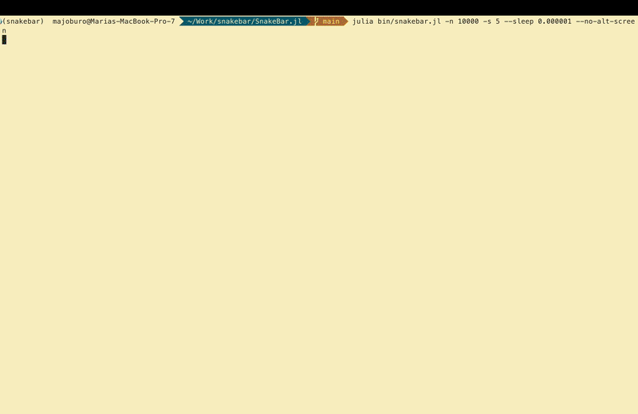

# SnakeBar.jl

A tqdm-like progress bar that fills your terminal with a one-character-thick snake along a random space-filling curve.



Based on [Random Space-Filling Curves](https://observablehq.com/@esperanc/random-space-filling-curves).

## Installation

```julia
using Pkg
Pkg.add(url="https://github.com/majoburo/SnakeBar.jl")
```

## Quick Start

### Basic Usage

```julia
using SnakeBar

# With do-block
snake_bar(1:100, desc="Processing") do i
    # your code here
    sleep(0.01)
end

# As iterator
for item in snake_bar(1:100, desc="Processing")
    # your code here
    sleep(0.01)
end
```

### Manual Control

```julia
using SnakeBar

bar = SnakeBAR(100, desc="Processing")
start!(bar)
try
    for i in 1:100
        # your work here
        sleep(0.01)
        update!(bar, 1)
    end
finally
    close!(bar)
end
```

### Multi-Snake (Parallel Tracking)

Track multiple independent processes with colored snakes:

```julia
using SnakeBar

# All snakes advance together
multi_snake_bar(1:100, 3, desc="3 Snakes") do i
    # your code here
    sleep(0.01)
end

# Or track independent progress
bar = MultiSnakeBAR(100, 3, desc="3 Parallel Processes")
start!(bar)
try
    for i in 1:100
        update_snake!(bar, 1, rand(1:3))  # Process 1
        update_snake!(bar, 2, rand(1:2))  # Process 2
        update_snake!(bar, 3, 1)          # Process 3
    end
finally
    close!(bar)
end
```

## Features

- Single snake progress bar with customizable characters
- Multi-snake mode with colored snakes for tracking parallel processes
- Independent progress tracking per snake
- Random space-filling curves generated each run (unless a seed is specified)
- tqdm-style status information (progress %, ETA, rate, and individual snake counters)
- Optimized rendering with rate limiting (60 FPS max)
- Alternate screen buffer support for clean terminal scrollback (enabled by default)

## CLI Usage

Run demos from the command line:

```bash
# Single snake
julia SnakeBar.jl/bin/snakebar.jl -n 200 --desc "Processing" --sleep 0.01

# Multiple colored snakes
julia SnakeBar.jl/bin/snakebar.jl -n 200 -s 3 --desc "3 Snakes" --sleep 0.01
```

See `julia bin/snakebar.jl --help` for all options.

## See Also

- [API Reference](api.md) - Complete API documentation with all functions and types
